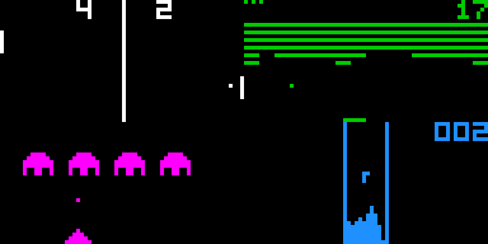

# CHIP-8 Interpreter
A CHIP-8 interpreter written in Python



## Usage
```
python3 chip8.py <file>
```
or
```
./chip8.py <file>
```

### Optional arguments
```
usage: chip8.py [-h] [-f FREQUENCY] [-s SCALE] [-c COLOR] [--legacy] [--error]
                [--log]
                rom

CHIP-8 interpreter

positional arguments:
  rom           path to file

optional arguments:
  -h, --help    show this help message and exit
  -f FREQUENCY  set CPU speed [Hz] (default: 500)
  -s SCALE      set display scale (default: 10)
  -c COLOR      set display color (default: white)
  --legacy      use legacy settings
  --error       show error messages
  --log         show log
```

## Keypad
```
CHIP-8                 Keyboard
+---------------+      +---------------+
| 1 | 2 | 3 | C |      | 1 | 2 | 3 | 4 |
|---|---|---|---|      |---|---|---|---|
| 4 | 5 | 6 | D |      | Q | W | E | R |
|---|---|---|---|  ->  |---|---|---|---|
| 7 | 8 | 9 | E |      | A | S | D | F |
|---|---|---|---|      |---|---|---|---|
| A | 0 | B | F |      | Z | X | C | V |
+---------------+      +---------------+
```
